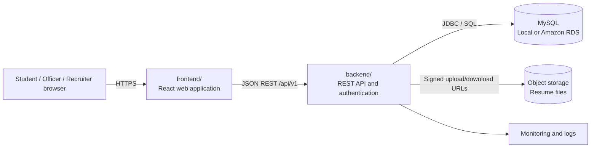
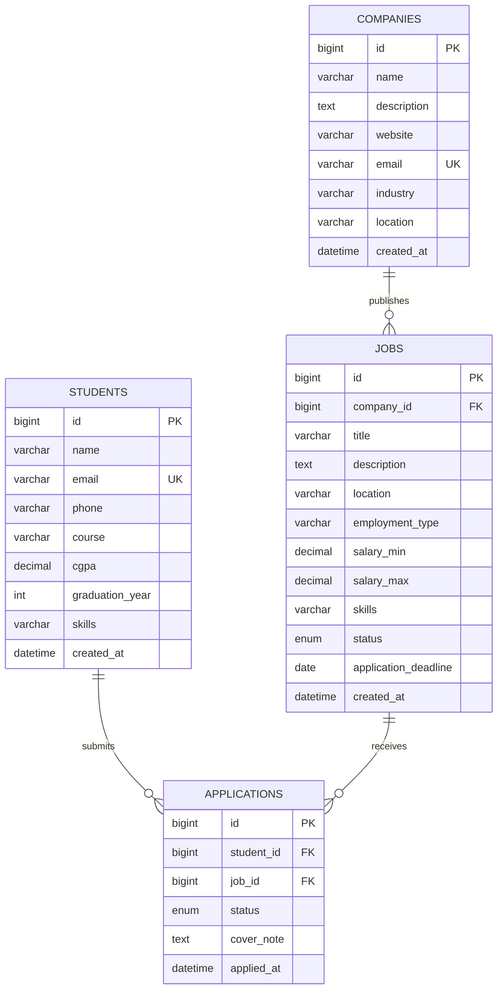

# Placement Portal

Placement Portal is a web application for managing campus recruitment. It gives
students a single place to maintain their profile, browse eligible drives, and
track applications. Placement officers can publish drives, define eligibility
criteria, and monitor applications, while recruiters can review candidates and
update hiring outcomes.

> **Repository note:** This repository currently contains the project root. The
> structure and commands below assume the conventional `backend/` and
> `frontend/` applications described in this document. Keep those applications
> in their respective directories; root-level documentation and deployment
> configuration should not be mixed into either application.

## Contents

- [Overview](#overview)
- [Architecture](#architecture)
- [Technologies](#technologies)
- [Folder structure](#folder-structure)
- [Data model](#data-model)
- [Prerequisites](#prerequisites)
- [Local MySQL setup](#local-mysql-setup)
- [Backend setup](#backend-setup)
- [Frontend setup](#frontend-setup)
- [Environment variables](#environment-variables)
- [API endpoints](#api-endpoints)
- [AWS RDS Multi-AZ preparation](#aws-rds-multi-az-preparation)
- [Development guidelines](#development-guidelines)

## Overview

### Main roles

- **Student:** registers, maintains a profile and resume, views matching
  placement drives, applies, and follows application status.
- **Placement officer:** manages students and companies, creates drives,
  configures eligibility rules, and views placement reports.
- **Recruiter:** manages company information, reviews applications, and records
  shortlisted, selected, or rejected outcomes.

### Typical workflow

1. A company and placement drive are created.
2. Eligibility rules are configured for the drive.
3. Students see drives for which they qualify and submit applications.
4. Recruiters and placement officers review applications.
5. Application status is updated through the recruitment process.

## Architecture

The system uses a separated frontend/backend design:

- The **frontend** is a browser application that calls the backend over HTTP.
- The **backend** exposes versioned REST endpoints, authenticates users, applies
  business rules, and owns database access.
- **MySQL** stores transactional data and is accessed only by the backend.
- Uploaded resumes and other durable files should use object storage in
  production; the database should store their metadata and URL.



## Technologies

The expected implementation uses:

| Layer | Technology |
| --- | --- |
| Frontend | React, JavaScript or TypeScript, Vite, HTML/CSS |
| Backend | Java 21, Spring Boot 3.5.6, Spring Web, Spring Data JPA, Bean Validation |
| Authentication | To be added; protect the planned endpoints before production use |
| Database | MySQL 8.0+ |
| Build tools | npm for the frontend and Maven or Gradle for the backend |
| Production database | Amazon RDS for MySQL with Multi-AZ |
| Production files | Amazon S3 or an equivalent private object store |
| API format | JSON over REST |

If the implementation chooses equivalent tools, update this table and the
commands in this README at the same time so the setup remains reproducible.

## Folder structure

The root should remain a small coordination layer around the two applications:

```text
placement_portal/
├── README.md
├── backend/
│   ├── pom.xml
│   ├── src/main/java/com/placementportal/
│   │   ├── PlacementPortalApplication.java
│   │   ├── config/
│   │   ├── model/               # Student, Company, Job, Application
│   │   ├── dto/                 # Request and response records
│   │   ├── controller/
│   │   ├── service/
│   │   ├── exception/
│   │   └── repository/          # Spring Data repositories
│   ├── src/main/resources/
│   │   ├── application.yml
│   │   └── db/migration/       # optional Flyway/Liquibase migrations
│   └── src/test/
├── frontend/
│   ├── package.json
│   ├── public/
│   └── src/
│       ├── components/
│       ├── pages/
│       ├── services/            # API client
│       ├── hooks/
│       └── assets/
└── docs/                        # optional design and API documentation
```

Do not commit build output such as `backend/target/`, `frontend/dist/`, or
`node_modules/`.

## Data model

The following schema is the baseline relational model. Foreign keys and
appropriate indexes should be present in the actual migrations.



The implemented JPA model uses `students`, `companies`, `jobs`, and
`applications` tables. Application statuses are `APPLIED`, `SHORTLISTED`,
`INTERVIEW`, `SELECTED`, `REJECTED`, and `WITHDRAWN`; job statuses are `OPEN`
and `CLOSED`.

The entities enforce unique student and company email addresses, plus a unique
`(student_id, job_id)` pair so a student cannot apply to the same job twice.
Jobs require a company, and applications require both a student and a job.
Additional eligibility rules, user accounts, status history, and resume storage
can be introduced through versioned migrations as those features are added.

## Prerequisites

- Git
- Java 21
- Maven
- Node.js 18+ and npm
- MySQL 8.0+
- An editor such as VS Code

Check the application manifests before installing another version. The
manifests are the source of truth for exact dependency versions.

## Local MySQL setup

Create a development database and a least-privilege application user:

```sql
CREATE DATABASE placement_portal
  CHARACTER SET utf8mb4
  COLLATE utf8mb4_unicode_ci;

CREATE USER 'placement_app'@'localhost' IDENTIFIED BY 'change-this-password';
GRANT SELECT, INSERT, UPDATE, DELETE, CREATE, ALTER, INDEX
  ON placement_portal.* TO 'placement_app'@'localhost';
FLUSH PRIVILEGES;
```

Start MySQL, then let the backend migrations create or update tables. If the
project does not yet use migrations, apply the checked-in schema or SQL
initialization script once and keep future schema changes versioned.

Never use the root MySQL account from the application and never commit the
password.

## Backend setup

From the repository root:

```powershell
cd backend
mvn spring-boot:run
```

The backend should listen on `http://localhost:8080` by default. A useful
health check is `GET /actuator/health` when Spring Boot Actuator is enabled.
For a packaged run:

```powershell
mvn clean package
java -jar target\placement-portal-backend-0.0.1-SNAPSHOT.jar
```

## Frontend setup

Install dependencies and start the development server:

```powershell
cd frontend
npm install
npm run dev
```

Vite commonly serves the frontend at `http://localhost:5173`. Configure the
development API base URL to point to `http://localhost:8080/api/v1`, or use a
development proxy to avoid browser CORS issues. For a production build:

```powershell
npm run build
npm run preview
```

## Environment variables

Use a local, uncommitted environment file or IDE run configuration. These are
the variables currently consumed by `backend/src/main/resources/application.yml`.

### Backend

```dotenv
DB_URL=jdbc:mysql://localhost:3306/placement_portal?createDatabaseIfNotExist=true&useSSL=false&serverTimezone=UTC
DB_USERNAME=placement_app
DB_PASSWORD=change-this-password
DDL_AUTO=update
PORT=8080
CORS_ALLOWED_ORIGINS=http://localhost:3000,http://localhost:5173
```

`DB_URL` defaults to a local MySQL URL, `PORT` defaults to `8080`, and
`CORS_ALLOWED_ORIGINS` defaults to both common local frontend ports. The current
development default is `DDL_AUTO=update`; use `validate` with migrations in
production. Prefer environment-variable binding over checked-in secrets, and
use a secret manager for `DB_PASSWORD`.

### Frontend

Vite exposes only variables prefixed with `VITE_` to browser code:

```dotenv
VITE_API_BASE_URL=http://localhost:8080/api/v1
```

Do not put database credentials, private keys, or signing secrets in frontend
variables; browser-visible values are not secret.

## API endpoints

The current backend exposes REST endpoints under `/api`. Authentication and
role-based authorization are not yet implemented, so treat these endpoints as
development-only until security is added. Requests and responses use the DTOs
in `com.placementportal.dto.Dtos`.

| Method | Path | Auth | Purpose |
| --- | --- | --- | --- |
| GET | `/api/students?search=&page=&size=` | Development | List students |
| GET | `/api/students/{id}` | Development | Read a student |
| POST | `/api/students` | Development | Create a student |
| PUT | `/api/students/{id}` | Development | Update a student |
| DELETE | `/api/students/{id}` | Development | Delete a student |
| GET | `/api/companies?search=&page=&size=` | Development | List companies |
| GET | `/api/companies/{id}` | Development | Read a company |
| POST | `/api/companies` | Development | Create a company |
| PUT | `/api/companies/{id}` | Development | Update a company |
| DELETE | `/api/companies/{id}` | Development | Delete a company |
| GET | `/api/jobs?search=&companyId=&status=&page=&size=` | Development | List/filter jobs |
| GET | `/api/jobs/{id}` | Development | Read a job |
| POST | `/api/jobs` | Development | Create a job |
| PUT | `/api/jobs/{id}` | Development | Update a job |
| DELETE | `/api/jobs/{id}` | Development | Delete a job |
| GET | `/api/applications?studentId=&jobId=&status=&page=&size=` | Development | List/filter applications |
| GET | `/api/applications/student/{studentId}` | Development | List one student's applications |
| POST | `/api/applications` | Development | Create an application |
| PATCH | `/api/applications/{id}/status` | Development | Change application status |
| DELETE | `/api/applications/{id}` | Development | Delete an application |
| GET | `/api/dashboard/stats` | Development | Return dashboard counts |

Return consistent JSON errors, validate request bodies at the API boundary, and
enforce role and resource ownership checks in the backend rather than relying
on frontend route visibility.

## AWS RDS Multi-AZ preparation

The application should be deployment-ready for Amazon RDS for MySQL without
requiring code changes during a failover.

1. **Use a production-grade RDS instance.** Create the DB instance in a VPC
   with private subnets in at least two Availability Zones and enable
   **Multi-AZ**. The application must connect to the RDS DNS endpoint, never
   to an individual instance IP.
2. **Use security groups, not public access.** Allow inbound MySQL traffic on
   port 3306 only from the backend's security group. Keep the database
   publicly inaccessible unless there is an explicitly approved exception.
3. **Use a managed secret.** Store the RDS username and password in AWS
   Secrets Manager or SSM Parameter Store and inject them at runtime. Rotate
   credentials without committing them to this repository.
4. **Configure connection resilience.** Use a bounded connection pool, sensible
   connection and validation timeouts, and retry only safe, idempotent
   connection initialization. Do not blindly retry a write that may have
   committed.
5. **Keep schema changes repeatable.** Run Flyway or Liquibase migrations from
   a controlled deployment step. Set production schema behavior to validate,
   not automatic create or update.
6. **Enable backups and observability.** Configure automated backups, a
   retention period, deletion protection, encryption at rest, Performance
   Insights, CloudWatch logs, and alarms for CPU, storage, connections, and
   replica/failover events.
7. **Test failover before launch.** Verify that the backend reconnects after an
   RDS failover, that health checks recover, and that frontend requests receive
   a useful error while the database is unavailable.
8. **Plan file storage separately.** Store resumes in a private S3 bucket with
   server-side encryption and short-lived signed URLs. RDS should contain only
   file metadata and references.

The RDS endpoint and credentials should be supplied through the same backend
variables described above:

```dotenv
DB_URL=jdbc:mysql://placement-portal.xxxxxxx.us-east-1.rds.amazonaws.com:3306/placement_portal?useSSL=true&serverTimezone=UTC
DB_USERNAME=placement_app
DB_PASSWORD=<injected-at-runtime>
DDL_AUTO=validate
```

## Development guidelines

- Keep frontend and backend changes isolated to their own directories.
- Add a migration for every schema change and test it against a clean database.
- Keep authorization checks on the server for every protected endpoint.
- Use parameterized queries or ORM parameters; never concatenate user input into
  SQL.
- Return UTC timestamps from the API and document the chosen status values.
- Add unit and integration tests for eligibility rules, duplicate applications,
  status transitions, and role-based access.
- Before opening a pull request, run the backend test command from `backend/`
  and the frontend lint, test, and build commands declared in
  `frontend/package.json`.
# placement-portal

